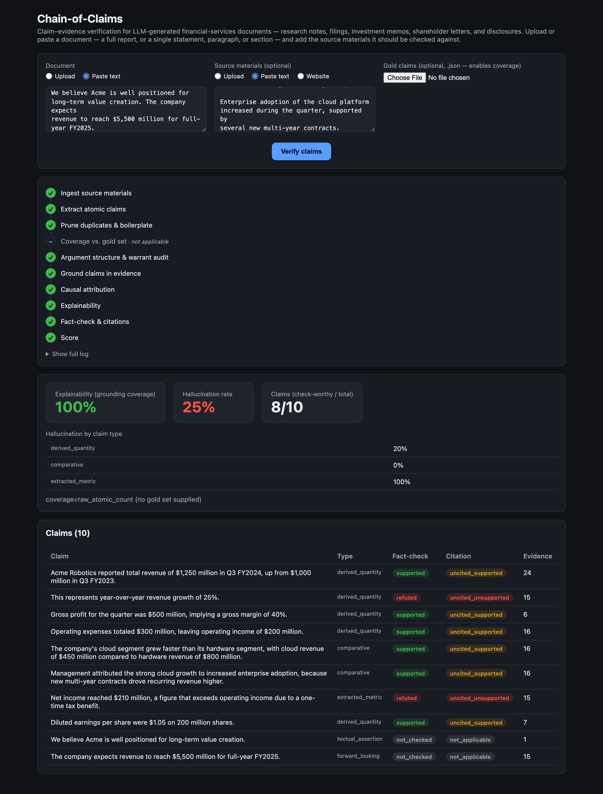
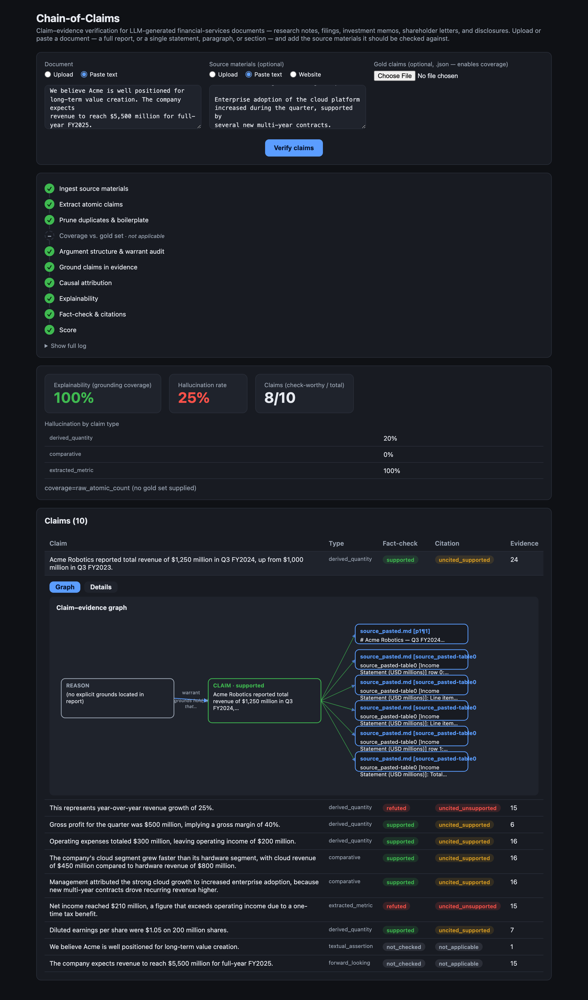
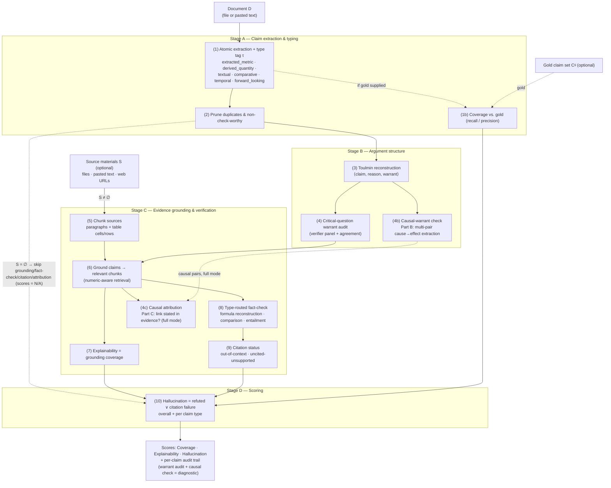

# Chain-of-Claims

**An integrated benchmark and agentic pipeline for claim–evidence reasoning in
LLM-generated financial-services documents.**

Chain-of-Claims operationalises a single, end-to-end task that recurs across the
document-generation workflows now proliferating in financial institutions: given a
LLM-generated or LLM-assisted document — supplied as a file or pasted directly, and
ranging from a full report down to a single statement — and, optionally, the source
materials it should be checked against, decompose the document into atomic claims,
reconstruct the argumentative structure linking each claim to its grounds, retrieve and
verify each claim against the supplied evidence, and report interpretable, per-claim
measures of **coverage**, **explainability**, and **hallucination**. The system is
realised as a deterministic controller orchestrating a set of LLM-backed stages, with a
web interface for analyst- and compliance-facing inspection.

---

## Demo

The web interface takes a document plus optional source materials, runs the full
pipeline with live per-stage progress, and reports the three headline scores alongside
a per-claim audit table. Below, a short equity-research note is checked against its
source filing; the pipeline recovers ten claims, grounds every check-worthy one, and
**refutes exactly the two injected errors** — the overstated net income ($210M in the
note vs. $190M in the filing) and the year-over-year growth that follows from it —
while verifying the true derived quantities (gross margin, operating income, EPS).



Expanding any claim reveals its argument structure as a
**claim → reason → warrant → evidence** graph (coloured by verdict, linked to the exact
supporting chunks), with a companion *Details* view showing the critical-question
warrant audit and, for causal claims, the extracted cause→effect pairs and their
evidence attribution.



> The screenshots above were produced with the deterministic offline provider
> (`COC_OFFLINE=1`), so the run is reproducible without an API key; results with the
> live model are qualitatively the same. See §6 for how to launch the app.

---

## 1. Problem statement and motivation

Large language models — Claude, GPT-4-class systems, and their "deep research" variants
— have moved rapidly from experimentation into production content workflows across the
financial sector. Sell-side and buy-side firms use them to draft equity and credit
research notes, investment theses, and market commentary; asset managers and wealth
advisors to produce portfolio reviews, investment-committee memos, and client-facing
suitability rationales; banks and issuers to assemble sections of regulatory filings,
prospectuses, and offering documents; corporate finance and investor-relations teams to
draft earnings scripts, management discussion, shareholder letters, and press releases;
and risk, compliance, and audit functions to summarise policy, model documentation, and
disclosures. In each case the model typically works over a defined evidence base —
filings, financial statements, transcripts, data-room documents, internal models, prior
disclosures — and emits a fluent draft that a human reviews and forwards.

What makes this consequential is the *audience* for these documents. They are not
internal scratch work: they are shared with securities regulators, exchanges and listing
authorities, auditors, institutional and retail investors, boards, and shareholders,
and they inform capital allocation, pricing, and disclosure obligations. A fabricated
metric, a figure attributed to the wrong source, a miscomputed ratio, or an assertion
with no basis in the underlying evidence is therefore not a stylistic defect but a
material misstatement — carrying regulatory, fiduciary, reputational, and legal exposure,
and arriving precisely as high-risk-AI obligations (e.g. disclosure and human-oversight
requirements) come into force. The bottleneck is not fluent generation, which current
models perform well, but *epistemic accountability*: at review time, every factual
assertion in a generated document should be traceable to supporting evidence, and every
unsupported, miscited, or miscomputed assertion should be surfaced for a human before the
document leaves the institution.

Chain-of-Claims addresses this review-time verification problem. It is document-type
agnostic — a research note, an MD&A section, an IC memo, and a shareholder letter are all,
for its purposes, a body of text making claims that must hold against a supplied evidence
base — and it is deliberately *retrieval-equalised* to the institution's own source
materials, mirroring the reality that these documents are (or are required to be) grounded
in a specific, auditable record rather than in the open web.

Despite the breadth of these use cases, no single benchmark evaluates the full
claim–evidence reasoning chain in this domain. The relevant literature is fragmented
across four strands:

1. **General fact verification.** The retrieve-then-verify paradigm was established by
   FEVER [Thorne et al., 2018] and extended by the CLEF *CheckThat!* shared tasks and
   explainable-verification work [Kotonya & Toni, 2020]. These operate on open-domain
   textual claims and do not model financial tables, numerical derivation, or
   regulatory filings.

2. **Financial numerical reasoning.** FinQA [Chen et al., 2021] and TAT-QA [Zhu et al.,
   2021] introduced numerical reasoning over hybrid tabular–textual financial data, and
   FinChain [2025] targets verifiable chain-of-thought financial reasoning. These are
   *question-answering* benchmarks; they test answering, not verification of asserted
   claims against evidence.

3. **Financial claim verification (emerging).** FinGround [2026] is the closest method:
   it decomposes answers into *atomic claims*, classifies them under a six-type
   financial taxonomy, and applies *type-routed* verification — including arithmetic
   re-verification against tables — reporting that a large fraction of financial errors
   are computational and are missed when all claims are treated uniformly. It is a
   pipeline rather than a shared, report-level benchmark.

4. **Report-level attribution and grounding.** DEER [2025] provides a rubric-based
   benchmark for deep-research reports with a claim-verification component covering
   both cited and uncited claims; the Table–Text Alignment work [2025] shows that LLMs
   often predict correct verification labels *without* recovering the human-aligned,
   cell-level rationale; and citation-attribution studies (CiteGuard; the
   generation-time vs. post-hoc citation analysis, 2025) formalise when a citation is
   faithful.

**The gap.** No existing benchmark simultaneously (a) operates at full-document scale
(as opposed to isolated single-claim or single-question instances), (b) covers the full
taxonomy of financial claim types, (c) verifies both cited and uncited claims against
heterogeneous text-plus-table evidence at appropriate granularity, and (d) makes the
*inferential structure* of each claim explicit and auditable. Chain-of-Claims occupies
precisely this intersection. Its distinctive contribution relative to FinGround and DEER
is an explicit **argument-structure layer**: neither prior system reconstructs the
⟨claim, reason, warrant⟩ skeleton of an assertion or audits *why* a claim is supposed to
follow from its stated grounds. For causal warrants this includes extracting the
asserted cause→effect links and checking whether the evidence actually *states* that
causation rather than merely co-locating the two facts — while deliberately stopping
short of judging whether the causation is true, a task on which current LLMs are
near-random [Jin et al., 2024].

---

## 2. Task formulation

Let a document `D` (a research note, filing section, investment memo, shareholder
letter, or any comparable artifact — provided as a file or as pasted text) be
accompanied by an *optional* corpus of source materials `S = {S₁, …, Sₙ}` — the evidence
base `D` should be checked against. Source materials may be uploaded files, pasted text,
or web URLs that the system fetches and reduces to text. The system produces:

- a set of atomic claims `C = {c₁, …, cₘ}` extracted from `D`, each typed by a financial
  claim taxonomy `τ(cᵢ)`;
- for each claim, a Toulmin triple `⟨cᵢ, rᵢ, wᵢ⟩` where `rᵢ` (reason/grounds) is taken
  from `D` and `wᵢ` (warrant) is the reconstructed inferential link, plus a diagnostic
  warrant audit — a critical-question panel score and, for causal warrants, the
  extracted cause→effect pairs and their attribution against the evidence;
- a grounding relation `G ⊆ C × E`, where `E` is the set of evidence chunks derived from
  `S`, marking which chunks support which claims;
- a verdict per claim comprising a fact-check result and a citation status.

When `S = ∅` (no source materials supplied), claim extraction, typing, and
argument-structure reconstruction still run, but the evidence-dependent stages
(grounding, fact-checking, citation) are skipped and their scores reported as *not
applicable* rather than as failures — absence of evidence is not treated as evidence of
error.

Evaluation is **retrieval-equalised**: candidate evidence is drawn only from `S`, so the
system measures verification competence rather than retrieval luck (following FinGround's
methodological recommendation).

---

## 3. Method

The pipeline is a deterministic controller executing a fixed sequence of stages
(A–D); state is persisted after each stage, so runs are inspectable, resumable, and
failure-localising. LLM calls are issued through a provider-agnostic interface (see §5).




### Stage A — Claim extraction and typing

- **(1) Atomic extraction and typing.** `D` is decomposed into atomic claims — one
  verifiable assertion each — following the atomicity principle of FactScore
  [Min et al., 2023]. Each claim is tagged with a type from a FinGround-style taxonomy:
  `extracted_metric`, `derived_quantity`, `textual_assertion`, `comparative`,
  `temporal`, or `forward_looking`. **This type tag routes verification in Stage 8** and
  is the highest-leverage design decision, because derived (computed) claims otherwise
  pass unchecked.
- **(1b) Coverage.** When a human-annotated gold claim set is supplied, extraction
  *completeness* is scored as recall against it, using semantic matching (the extractor
  legitimately rewords and re-splits claims) backed by a deterministic
  numeric-plus-lexical floor. Coverage measures *whether the claims a document makes were
  recovered* — a distinct axis from whether those claims are true.
- **(2) Pruning.** Near-duplicate claims are removed and non-check-worthy boilerplate
  ("motherhood" statements, opinion, framing) is gated out of scoring while retained for
  audit.

### Stage B — Argument structure (the distinguishing layer)

- **(3) Toulmin reconstruction.** Following the zero-shot Toulmin explication method of
  Gupta, Zuckerman & O'Connor [2024], each claim is paired with its *reason* (grounds,
  quoted from `D`) and an LLM-generated *warrant* (the implicit principle licensing the
  inference). Warrants are explicitly flagged as machine-generated so a downstream audit
  failure can be attributed to the document rather than to our own generator.
- **(4) Critical-question warrant audit.** Each warrant is assessed against the eight
  Critical-Questions-of-Thought of Castagna, Sassoon & Parsons [2024], targeting the
  Data, Warrant, Backing, Claim, and Qualifier components of the argument. Because
  warrant acceptability is intrinsically subjective — Gupta et al. report gold warrants
  judged acceptable only ~46% of the time (κ ≈ 0.18) — the audit is a **diagnostic
  signal, not a hard gate**: it is scored by a *panel* of independent verifiers with
  reported inter-verifier agreement.
- **(4b) Causal-warrant check.** For warrants asserting causation, a two-part check
  runs (config-gated by `COC_CAUSAL_CHECK_MODE` = `off` / `structural` / `full`; see
  `docs/spec-causal-warrant-checking.md`):
  - **Part B — structural extraction.** An LLM structured-output call recovers *every*
    cause→effect pair the warrant asserts. This is multi-pair by construction and needs
    no training data or domain transfer, so it **replaces** both the earlier regex
    heuristic and the mooted DEPBERT-style fine-tuned tagger [Kabir, Jahin & Al Hasan,
    2025] — a tagger both fails to transfer to financial text and reproduces the
    one-cause–effect-pair-per-sentence limit that a general-domain benchmark such as
    UniCausal [Tan et al., 2023] exhibits. It records *what causation is claimed*, not
    whether it is true.
  - **Part C — causal attribution.** In `full` mode, after grounding (Stage 6), each
    extracted pair is checked against the claim's grounded evidence: does the evidence
    *state* the causal link (`attributed`), merely mention both relata (`co_occurrence
    _only`), describe a purpose/concessive relation (`purpose_or_concessive`), or
    contradict it (`contradicted`)? Confusing purpose/co-occurrence for causation is the
    dominant real-world error class in FinCausal 2025's [Moreno-Sandoval et al.] error
    analysis. This is a **grounding** question, never a substantive-truth judgement:
    Corr2Cause [Jin et al., 2024] shows off-the-shelf LLMs infer causation from
    correlation at near-random accuracy, so causal truth stays out of scope and out of
    the enum. Attribution is skipped (`not_applicable`) when no sources are supplied or
    the claim has no grounding.

  Both parts are **diagnostic and low-weighted**: the causal signal is surfaced in the
  per-claim audit and never enters the hallucination score.

### Stage C — Evidence grounding and verification

- **(5) Chunking.** Narrative text is chunked by paragraph; tables are chunked at both
  row and *cell* granularity. Cell-level granularity is motivated by the Table–Text
  Alignment finding [2025] that verification requires localising the specific supporting
  cell. Unit/scale context (e.g. "USD millions") from a table caption is propagated into
  each cell chunk, so a bare cell value "500" can support the claim "$500 million".
- **(6) Grounding.** For each claim, candidate chunks are shortlisted with a
  numeric-aware retrieval score — an overlap coefficient over content tokens (which does
  not penalise short cells) plus a strong boost for shared *normalised* figures, with a
  guarantee that any chunk sharing a figure with the claim is a candidate — and an LLM
  judges which candidates are genuinely relevant.
- **(7) Explainability.** The fraction of check-worthy claims grounded in at least one
  relevant chunk. This is the grounding-coverage axis that DEER's rubric and FinGround's
  grounding stage also target, enabling comparison to external baselines.
- **(8) Type-routed fact-checking.** Verification strategy is selected by claim type:
  `derived_quantity` → formula reconstruction against grounded cells via an agentic
  loop with a calculator tool; `comparative` → figure-comparison with the calculator;
  `temporal`/`textual_assertion`/`extracted_metric` → evidence lookup and entailment;
  `forward_looking` → not checked (unverifiable against historical sources). The
  computational routes are prompted to fetch each input and compute rather than abstain,
  addressing the computational-error blind spot identified by FinGround.
- **(9) Citation status.** Two failure modes are distinguished, following DEER and the
  attribution-alignment framing: *out-of-context* (cited evidence supports a different
  claim than the one it is attached to) and *uncited-and-unsupported* (no citation and
  no supporting evidence — the most severe case). Both cited and uncited claims are
  scored.

### Stage D — Scoring

- **(10) Hallucination.** A check-worthy claim is counted as a hallucination if it is
  *refuted* or has a citation failure. The score is reported overall and **per claim
  type**, so computational hallucination is separable from textual — the diagnostic
  FinGround emphasises.

### 3.1 Metrics

For check-worthy claims `C⁺ ⊆ C` and gold set `Cᵍ` (when provided):

- **Coverage (recall)** = `|{g ∈ Cᵍ : g matched by some c ∈ C}| / |Cᵍ|`
- **Coverage (precision)** = `|{c ∈ C : c matches some g ∈ Cᵍ}| / |C|`
- **Explainability** = `|{c ∈ C⁺ : c grounded in ≥1 relevant chunk}| / |C⁺|`
- **Hallucination** = `|{c ∈ C⁺ : refuted(c) ∨ citation_failure(c)}| / |C⁺|`,
  reported overall and stratified by `τ`.

---

## 4. Architecture

```
backend/
  chain_of_claims/
    pipeline.py          # deterministic controller; persists state per stage
    models.py            # Pydantic schemas (claims, triples, chunks, verdicts, scores)
    db.py                # SQLite persistence
    ingest/              # PDF / text / markdown parsing; web-URL fetch + HTML→text;
                         #   paragraph + cell/row chunking
    stages/              # s1_extract, s1b_coverage, s2_prune, s3_toulmin,
                         #   s4_warrant_audit, s4b_causal_attribution, s6_ground,
                         #   s7_explainability, s8_factcheck, s9_citations,
                         #   s10_hallucination
    llm/                 # LLMProvider interface + Anthropic impl + offline stub + tools
    api.py               # FastAPI: document (file/text) + optional sources
                         #   (files/text/URLs), background run, SSE progress, results
frontend/                # React + Vite: upload, live progress, per-claim table,
                         #   score tiles, and a claim→reason→warrant→evidence graph
```

The controller is deterministic; only the stage-internal reasoning is model-driven.
State is written to SQLite after each stage, making every intermediate artifact —
extracted claims, triples, warrant-audit panels, groundings, verdicts — independently
inspectable.

---

## 5. Provider abstraction and reproducibility

All model access is mediated by a swappable `LLMProvider` interface exposing
`structured_output` (schema-constrained via forced tool use) and `tool_loop` (agentic
tool use for Stage 8). Two concrete implementations are provided:

- **Anthropic** (v1 default), configured by API key *or* by a bearer token and base URL
  for gateway/proxy deployments common in financial-services environments.
- **Offline deterministic stub**, which returns schema-valid, heuristic outputs so the
  entire pipeline is executable, testable, and demonstrable with no API key — important
  for reproducible CI and for isolating pipeline logic from model behaviour.

Model tiering is configurable: a faster model for mechanical transform stages, a
stronger model for the judgement-heavy warrant audit and fact-check.

---

## 6. Quick start

```bash
# Backend
cd backend
python3 -m venv .venv && source .venv/bin/activate
pip install -e .
export ANTHROPIC_API_KEY=sk-...            # or ANTHROPIC_AUTH_TOKEN + ANTHROPIC_BASE_URL
uvicorn chain_of_claims.api:app --reload

# Frontend
cd frontend
npm install && npm run dev
```

Command-line, with optional gold set for coverage:

```bash
COC_OFFLINE=1 python -m chain_of_claims.cli \
    samples/report.md samples/source_filing.md --gold samples/gold_claims.json
```

In the web interface, the **document** can be uploaded as a file or pasted as text, and
**source materials** are optional and may be uploaded files, pasted text, or web URLs
(fetched and reduced to text server-side; unreachable URLs are skipped with a note in the
progress stream). The UI presents per-run **Coverage**, **Explainability**, and
**Hallucination** tiles (the latter with a per-type breakdown; explainability and
hallucination read *N/A* when no source materials are supplied) and an expandable
per-claim view offering a **Graph** rendering (reason → warrant → claim, coloured by
verdict, linked to evidence) and a **Details** rendering (warrant critical-question audit
and evidence list).

---

## 7. Evaluation and reproducibility

A worked example ships in `backend/samples/`: a short equity-research report, a source
filing whose income-statement table contradicts the report on two figures (net income,
diluted EPS), and a gold claim set. On this example the system:

- recovers the report's claims (coverage recall 1.0 against the gold set with the live
  model), grounds all check-worthy claims (explainability ≈ 0.94), and
- refutes exactly the injected errors while verifying the true derived quantities
  (year-over-year growth, gross margin, operating income) by formula reconstruction,
  yielding a per-type hallucination profile in which computational claims score 0.

Tests:

```bash
cd backend && source .venv/bin/activate

# Deterministic suite — no credentials required (offline provider):
COC_OFFLINE=1 pytest tests/test_pipeline.py tests/test_grounding.py \
    tests/test_factcheck.py tests/test_coverage.py

# Live smoke test — skips automatically unless credentials are present:
pytest tests/test_anthropic_smoke.py -v -s
```

The deterministic suite locks in the core behaviours (cell-level chunking with unit
propagation, numeric-aware grounding recall, robust verdict parsing, coverage
recall/precision semantics). The live smoke test exercises the real model path
end-to-end and asserts that the injected numerical error is caught.

---

## 8. Limitations

- **Causal warrant checking** is currently a lightweight regex-based structural
  heuristic (Stage 4). The v1 plan — swap in a DEPBERT-style tagger fine-tuned on
  financial text — is superseded by the evidence. The FinCausal shared task has itself
  moved away from cause–effect *span tagging* toward LLM-based causal QA, with
  fine-tuned and prompted generative LLMs taking the top ranks [FinCausal 2025]; and a
  general-domain span tagger such as UniCausal's [Tan et al., 2023] both fails to
  transfer to financial text (all six of its corpora are news/web) and reproduces the
  very one-cause–effect-pair-per-sentence limit that motivated the concern — its
  span-detection baseline predicts only a single pair per input. The planned
  replacement (specified in `docs/spec-causal-warrant-checking.md`) is two-part:
  **(B)** an LLM structured-output extractor recovering *all* explicit/implicit
  cause→effect pairs in a warrant — no training data, no domain-transfer problem,
  multi-pair by construction — replacing both the regex and the fine-tuned tagger; and
  **(C)** a causal *attribution* check that asks whether the asserted causal link is
  actually stated in the grounded evidence, versus merely co-occurring facts presented
  as causation (the dominant real-world error class in FinCausal's own analysis,
  where purpose/concessive relations are routinely mistaken for cause–effect). The
  check is deliberately bounded to grounding/attribution, **not** the substantive
  *truth* of the causation: Corr2Cause [Jin et al., 2024] shows off-the-shelf LLMs
  infer causation from correlation at near-random accuracy, so a causal-truth
  judgement stays out of scope and out of the score, and the attribution signal
  remains diagnostic (panel-reported, low-weighted) rather than a hard gate.
- **Warrant-audit subjectivity** is mitigated by a verifier panel and reported
  agreement, not eliminated; multiple valid warrants exist per claim.
- **Multi-period comparatives** (e.g. "segment X grew faster than Y") are unverifiable
  when the sources contain only a single period — a data-availability bound, not a
  pipeline defect, and one the system correctly reports as insufficient evidence rather
  than guessing.
- **Coverage** requires a human-annotated gold set; without one, extraction volume is
  reported descriptively rather than as recall.
- **Web-source ingestion** uses a lightweight HTML-to-text reduction and best-effort
  fetching (failed URLs are skipped, not fatal); it does not render JavaScript, and in a
  production deployment fetching user-supplied URLs would require SSRF hardening
  (blocking private address ranges, restricting schemes). Fetched web content also
  relaxes the retrieval-equalised guarantee, since it originates outside a fixed,
  auditable corpus.

---

## References

- Castagna, F., Sassoon, I., & Parsons, S. (2024). *Critical-Questions-of-Thought:
  Steering LLM reasoning with Argumentative Querying.* arXiv:2412.15177.
- Chen, Z., et al. (2021). *FinQA: A Dataset of Numerical Reasoning over Financial Data.*
  EMNLP. arXiv:2109.00122.
- *DEER: A Benchmark for Evaluating Deep Research Agents on Expert Report Generation.*
  (2025). arXiv:2512.17776.
- *FinGround: Detecting and Grounding Financial Hallucinations via Atomic Claim
  Verification.* (2026). arXiv:2604.23588.
- Gupta, A., Zuckerman, E., & O'Connor, B. (2024). *Harnessing Toulmin's theory for
  zero-shot argument explication.* ACL. pp. 10259–10276.
- Jin, Z., Liu, J., Lyu, Z., Poff, S., Sachan, M., Mihalcea, R., Diab, M., &
  Schölkopf, B. (2024). *Can Large Language Models Infer Causation from Correlation?*
  ICLR. arXiv:2306.05836.
- Kabir, M. A., Jahin, S. M. A., & Al Hasan, M. (2025). *Extracting Cause-Effect Pairs
  from a Sentence with a Dependency-Aware Transformer Model (DEPBERT).* arXiv:2507.09925.
- Min, S., et al. (2023). *FActScore: Fine-grained atomic evaluation of factual
  precision in long-form text generation.* EMNLP.
- Moreno Sandoval, A., Carbajo Coronado, B., Porta Zamorano, J., Torterolo Orta, Y. A.,
  & Samy, D. (2025). *The Financial Document Causality Detection Shared Task (FinCausal
  2025).* Proc. Joint Workshop of the 9th FinNLP, 6th FNP, and 1st LLMFinLegal, pp.
  214–221. ACL.
- Tan, F. A., Zuo, X., & Ng, S.-K. (2023). *UniCausal: Unified Benchmark and Repository
  for Causal Text Mining.* arXiv:2208.09163.
- *Table-Text Alignment: Explaining Claim Verification Against Tables in Scientific
  Papers.* (2025). arXiv:2506.10486.
- Thorne, J., Vlachos, A., Christodoulopoulos, C., & Mittal, A. (2018). *FEVER: A
  Large-scale Dataset for Fact Extraction and VERification.* NAACL.
- Toulmin, S. (1958). *The Uses of Argument.* Cambridge University Press.
- Zhu, F., et al. (2021). *TAT-QA: A Question Answering Benchmark on a Hybrid of Tabular
  and Textual Content in Finance.* ACL. arXiv:2105.07624.

> **Note on citation keys.** Several 2025–2026 references (FinGround, DEER, Table–Text
> Alignment) are drawn from recent arXiv listings; verify the canonical publication
> venue and author list before inclusion in the paper's final bibliography.
